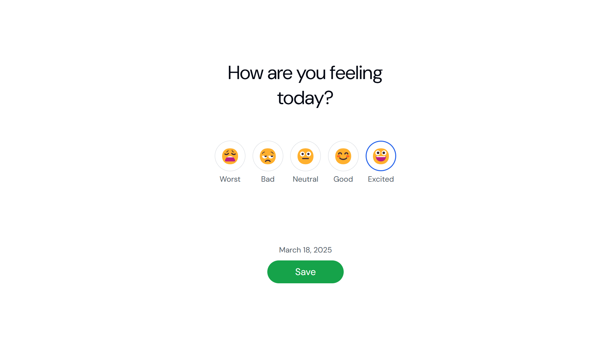

# Mood Tracker Application

## Features

- Track your daily mood with emojis and descriptions.
- View your mood history by day, week, or month.
- Automatically saves your selected mood for each day.
- Retains the last selected view even after a page refresh.
- Interactive UI with a simple and clean design.

## Screenshots



## Deployment Link

[Live Demo](https://mood-tracker-yeql.onrender.com)

## How to Use

1. Select your mood for the day by clicking on an emoji.
2. Click the "Save" button to store your mood.
3. Switch between day, week, or month views to analyze your mood history.
4. Your last selected view is saved and will persist after a page refresh.

## Installation

1. Clone the repository:
   ```sh
   git clone https://github.com/your-username/mood-tracker.git
   ```
2. Open `index.html` in a browser.
3. Start tracking your moods!

## Technologies Used

- HTML
- CSS
- JavaScript (Local Storage for data persistence)

## Contributing

Feel free to submit issues or pull requests to improve the application.

## License

This project is open-source and available under the [MIT License](LICENSE).
